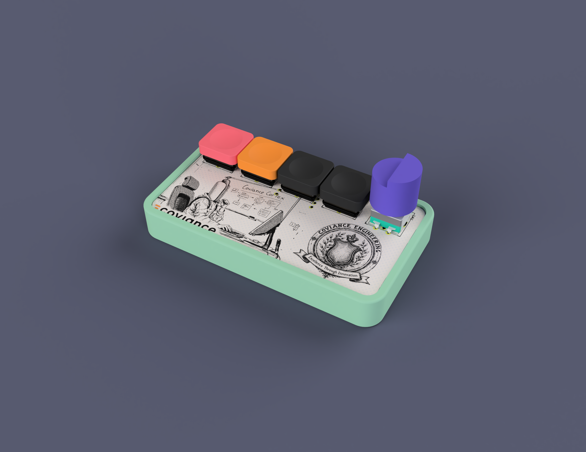
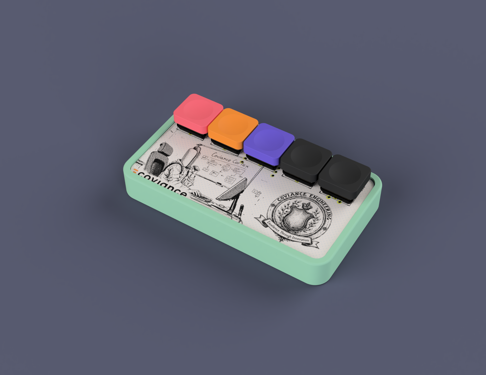

# Hotdog Pad

## Configuration
Configuring the keys of the macropad is simple. To modify the keybindings navigate to [vial.rocks](https://vial.rocks) with your macropad plugged in to your computer.

_note, your browser must support WebHID to update your keybindings! If you use Chrome you don't have to worry about this._

### The default keymap of the macropad is:

| Key 1 | Key 2 | Key 3 | Key 4 | Encoder/Key 5 |
|:-----:|:-----:|:-----:|:-----:|:-------------:|
| `CMD+D` | `CMD+E` | `SHFT+CMD+5` | :hotdog: | Volume Up/Down |

`CMD+D` is toggle mute in Google Hangouts

`CMD+E` is toggle camera in Google Hangouts

`SHFT+CMD+5` opens the screenshot menu on MacOS

## Features
 - 4 x Choc v1 switches
 - Choice between rotary encoder or 5th Choc switch
 - Xiao Seeed rp2040 microcontroller
 - RGB underglow via the Xiao Seeed onboard NeoPixel

Files for the 3D printed press fit case and rotary encoder knob can be found in the case directory.

PCB and gerber files can be found in the pcb directory